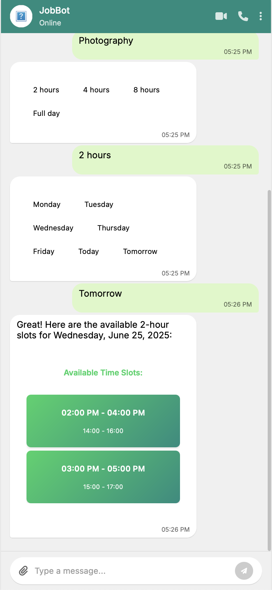
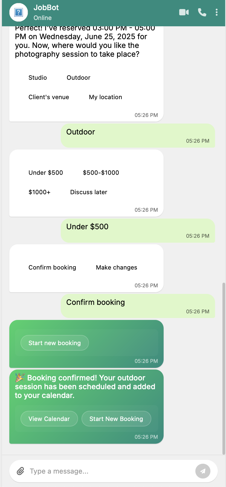
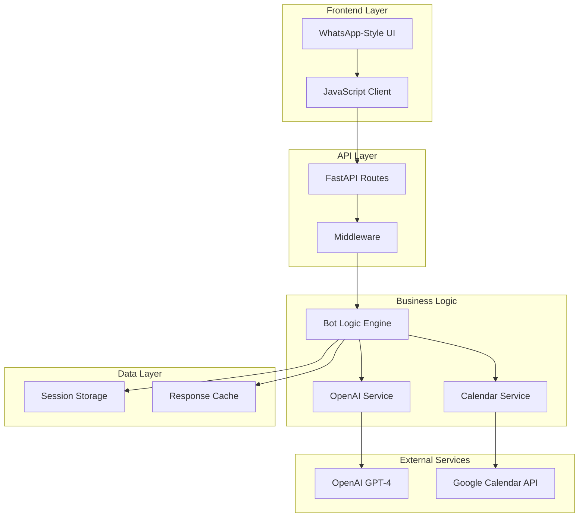

# 🤖 WhatsApp JobBot - AI-Powered Booking Assistant

A production-ready WhatsApp-style booking bot with AI-powered conversations, Google Calendar integration, and intelligent time slot management. Built with FastAPI, OpenAI GPT-4, and modern web technologies.

<table>
  <tr>
    <td width="50%">
      
    </td>
    <td width="50%">
      
    </td>
  </tr>
</table>
---

## 🚀 Features

### 💬 WhatsApp-Style Chat Experience
- **Pixel-perfect WhatsApp Web replica** with authentic chat bubbles and animations
- **Smart timeslot selection UI** with interactive button grids
- **Real-time typing indicators** and message status
- **Mobile-responsive design** optimized for all screen sizes
- **Smooth animations** and transitions for natural feel

### 🧠 Advanced AI Conversation Flow
- **OpenAI GPT-4 integration** with context-aware responses
- **Intelligent booking workflow** that adapts to user input
- **Natural language processing** for dates, times, and preferences
- **Personalized responses** using the user's actual name throughout
- **Error handling** with helpful suggestions and clarifications

### 📅 Google Calendar Integration
- **Real-time availability checking** against Google Calendar
- **Automatic time slot generation** based on working hours (9 AM - 5 PM)
- **Conflict detection** with 1-minute buffer between bookings
- **Calendar event creation** with detailed job information
- **Email notifications** and calendar invites to clients
- **Mock mode fallback** when credentials are unavailable

### 🎯 Smart Booking Management
- **Day-flexible scheduling** - supports "Monday", "today", "tomorrow", or specific dates
- **Duration-aware slot calculation** - automatically adjusts available times
- **Multiple date format support** - DD/MM/YYYY, DD-MM-YYYY, YYYY-MM-DD
- **Timezone handling** - proper UTC/local timezone conversion
- **Session persistence** - maintains conversation state across interactions

### ⚡ Production-Ready Architecture
- **FastAPI backend** with async request handling and dependency injection
- **Singleton pattern** for conversation state management
- **Comprehensive error handling** and logging throughout
- **RESTful API design** with automatic OpenAPI documentation
- **CORS support** and security headers

---

## 🛠️ Technology Stack

### Backend
- **FastAPI** - Modern, high-performance web framework with automatic API docs
- **Python 3.9+** - Latest async/await patterns and type hints
- **OpenAI GPT-4** - Advanced language model for natural conversations
- **Google Calendar API** - Real-time calendar integration and event management
- **Pydantic** - Data validation and serialization with type safety
- **Uvicorn** - ASGI server optimized for production

### Frontend
- **Vanilla JavaScript (ES6+)** - Modern async/await and fetch API
- **CSS3 Grid & Flexbox** - Responsive layouts with smooth animations
- **Font Awesome 6.0** - Scalable vector icons and symbols
- **Google Fonts (Inter)** - Professional typography

### Data & Processing
- **Google OAuth 2.0** - Secure calendar API authentication
- **Python-dateutil** - Robust date/time parsing and manipulation
- **Pytz** - Accurate timezone handling and conversion
- **Regex patterns** - Flexible duration and date parsing

---

## 📦 Installation & Setup

### Prerequisites
- **Python 3.9+** - Latest version recommended
- **Google Cloud Project** - For Calendar API access (optional for mock mode)
- **OpenAI API Key** - For AI conversation processing

### Quick Start

1. **Clone and setup environment**
   ```bash
   git clone <repository-url>
   cd whatsapp-booking-bot-poc
   python -m venv venv
   source venv/bin/activate  # Windows: venv\Scripts\activate
   ```

2. **Install dependencies**
   ```bash
   pip install -r requirements.txt
   ```

3. **Configure environment variables**
   ```bash
   cp .env.example .env
   # Edit .env with your API keys (see Configuration section)
   ```

4. **Set up Google Calendar (Optional)**
   ```bash
   # Place your OAuth credentials file as:
   # oauth-credentials.json (in project root)
   # First run will prompt for authorization
   ```

5. **Launch the application**
   ```bash
   python -m uvicorn app.main:app --reload --port 8000
   ```

6. **Access the interface**
   - **Main Chat**: http://localhost:8000
   - **API Docs**: http://localhost:8000/docs
   - **Health Check**: http://localhost:8000/health

---

## ⚙️ Configuration

### Environment Variables

Create `.env` file in the project root:

```env
# Application Settings
APP_NAME=WhatsApp JobBot PoC
FASTAPI_HOST=localhost
FASTAPI_PORT=8000
DEBUG=true

# OpenAI Configuration
OPENAI_API_KEY=your_openai_api_key_here
OPENAI_MODEL=gpt-4

# Google Calendar (Optional - will use mock mode if not provided)
GOOGLE_CALENDAR_CREDENTIALS=oauth-credentials.json
GOOGLE_CALENDAR_TOKEN=token.pickle
```

### Google Calendar Setup (Optional)

1. **Create Google Cloud Project**
   - Go to [Google Cloud Console](https://console.cloud.google.com/)
   - Create new project or select existing one

2. **Enable Calendar API**
   - Navigate to "APIs & Services" > "Library"
   - Search for "Google Calendar API" and enable it

3. **Create OAuth Credentials**
   - Go to "APIs & Services" > "Credentials"
   - Click "Create Credentials" > "OAuth 2.0 Client IDs"
   - Choose "Desktop Application"
   - Download the JSON file as `oauth-credentials.json`

4. **First Run Authorization**
   - Run the application
   - Browser will open for Google authorization
   - Grant calendar access permissions
   - Token will be saved automatically

---

### Service Responsibilities Summary

| Service | Responsibilities | When Called |
|---------|------------------|-------------|
| **Chat UI** | User interface, message display, timeslot buttons | Always (frontend) |
| **FastAPI** | Request routing, response formatting, CORS | Every user interaction |
| **Bot Logic** | Conversation flow, state management, session storage | Every message |
| **OpenAI GPT-4** | Natural language processing, response generation, data extraction | Text processing, confirmations |
| **Google Calendar** | Availability checking, slot generation, event creation | Day selection, final booking |
| **Session Storage** | Maintain conversation state, booking data persistence | Throughout conversation |

### Key Integration Points

1. **Name Collection** - Pure bot logic, no AI needed
2. **Job Type/Duration** - OpenAI processes and validates user input
3. **Day Selection** - Bot logic + Google Calendar for availability
4. **Timeslot Selection** - Pure matching logic, no external services
5. **Location/Budget** - OpenAI for natural language processing
6. **Final Confirmation** - OpenAI for summary + Google Calendar for booking

---

## 🏗️ Architecture & System Design

### Component Architecture



### Key Components

#### 🧠 Bot Logic Engine (`app/services/bot_logic.py`)
- **Conversation state management** - Tracks user progress through booking flow
- **Session persistence** - Maintains conversation context across requests
- **Dynamic response generation** - Adapts to user input and preferences
- **Error handling** - Graceful fallbacks and helpful error messages

#### 🤖 OpenAI Service (`app/services/openai_service.py`)
- **GPT-4 integration** - Natural language processing and response generation
- **Context-aware prompts** - Uses booking data and conversation history
- **Function calling** - Structured data extraction from user messages
- **Personalized responses** - Uses actual user names in conversations

#### 📅 Google Calendar Service (`app/services/google_calendar_service.py`)
- **OAuth 2.0 authentication** - Secure Google account integration
- **Real-time availability checking** - Queries calendar for free/busy times
- **Smart slot generation** - Creates available time slots based on duration
- **Event creation** - Books confirmed appointments with detailed information
- **Mock mode** - Realistic simulation when credentials unavailable

#### 🎨 Frontend Chat UI (`app/static/js/chat-ui.js`)
- **WhatsApp-style interface** - Authentic chat experience with animations
- **Timeslot selection** - Interactive button grid for time picking
- **Real-time updates** - Smooth message flow and typing indicators
- **Responsive design** - Works perfectly on desktop and mobile

---

## 🔌 API Reference

### Chat Endpoints

#### Send Message
```http
POST /api/v1/chat/message
Content-Type: application/json

{
  "content": "Photography",
  "session_id": "session_123",
  "conversation_state": "collecting_job_type"
}
```

**Response:**
```json
{
  "message": "Great choice! How long do you need the session?",
  "message_type": "text",
  "conversation_state": "collecting_duration",
  "booking_data": {
    "contact_name": "Alex Smith",
    "job_type": "Photography"
  },
  "suggested_actions": ["2 hours", "4 hours", "8 hours", "Full day"],
  "requires_input": true
}
```

### Calendar Endpoints

#### Get Available Slots
```http
POST /api/v1/calendar/available-slots
Content-Type: application/json

{
  "day_input": "Friday",
  "duration_hours": 4
}
```

#### Create Booking
```http
POST /api/v1/calendar/book
Content-Type: application/json

{
  "contact_name": "Alex Smith",
  "job_type": "Photography",
  "selected_slot": {
    "datetime": "2024-12-15T10:00:00",
    "display": "10:00 AM - 2:00 PM"
  },
  "duration_hours": 4,
  "location": "Downtown Studio",
  "budget": "$800-1200"
}
```

---

## 🚀 Deployment

### Development
```bash
# Run with auto-reload
uvicorn app.main:app --reload --port 8000

# Run with specific host
uvicorn app.main:app --host 0.0.0.0 --port 8000
```

### Production

#### Docker Deployment
```dockerfile
FROM python:3.9-slim

WORKDIR /app
COPY requirements.txt .
RUN pip install -r requirements.txt

COPY . .
EXPOSE 8000

CMD ["uvicorn", "app.main:app", "--host", "0.0.0.0", "--port", "8000"]
```

#### Heroku Deployment
Create `Procfile`:
```
web: uvicorn app.main:app --host 0.0.0.0 --port $PORT
```

#### Environment Variables for Production
```env
OPENAI_API_KEY=your_production_openai_key
FASTAPI_HOST=0.0.0.0
FASTAPI_PORT=8000
DEBUG=false
```

---

## 🧪 Testing

### Manual Testing Flow
1. **Start application**: `uvicorn app.main:app --reload`
2. **Open browser**: Navigate to http://localhost:8000
3. **Test complete flow**: Follow the conversation from greeting to booking confirmation
4. **Verify calendar**: Check that events are created (if Google Calendar configured)
5. **Test edge cases**: Try invalid dates, times, and inputs

### API Testing
```bash
# Health check
curl http://localhost:8000/health

# Send test message
curl -X POST http://localhost:8000/api/v1/chat/message \
  -H "Content-Type: application/json" \
  -d '{"content": "Alex Smith", "session_id": "test_123", "conversation_state": "collecting_contact"}'
```

---

## 🤝 Contributing

### Development Setup
1. Fork the repository
2. Create feature branch: `git checkout -b feature/amazing-feature`
3. Make changes and test thoroughly
4. Commit changes: `git commit -m 'Add amazing feature'`
5. Push to branch: `git push origin feature/amazing-feature`
6. Create Pull Request

### Code Style
- Follow PEP 8 for Python code
- Use type hints for all function parameters and returns
- Add docstrings for all public functions and classes
- Keep functions focused and under 50 lines when possible

---

## 📝 License

This project is licensed under the MIT License - see the [LICENSE](LICENSE) file for details.

---

## 🙏 Acknowledgments

- **OpenAI** - For providing the GPT-4 API that powers the conversation intelligence
- **Google** - For the Calendar API that enables real-time scheduling
- **FastAPI** - For the excellent web framework with automatic API documentation
- **WhatsApp** - For inspiration for the chat interface design

---

## 📞 Support

For questions, issues, or feature requests:
- **Create an issue** in the GitHub repository
- **Check the documentation** at http://localhost:8000/docs when running locally
- **Review the conversation flow** examples above

---

**Built with ❤️ for seamless booking experiences** 